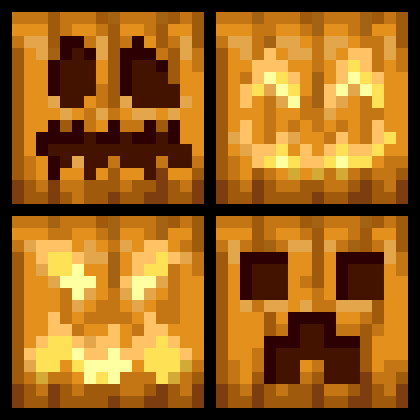

<div style="text-align: center;">
  
</div>

<h1 style="text-align: center;">More Pumpkin Faces - Emotions</h1>

<p style="text-align: center;">
  A Minecraft mod for Fabric 1.21 that adds a variety of new carved pumpkins with different emotional faces.
</p>

<hr>

## Features

- **New Pumpkin Blocks:** Adds a collection of new pumpkin blocks, each with a unique facial expression.
- **Wearable as Helmets:** Each new pumpkin variant can be worn in the helmet slot.
- **Directional Placement:** Place pumpkins to face in any of the four cardinal directions.
- **Minecraft 1.21 Compatible:** Built for the latest version of Minecraft.
- **Creative Tab Integration:** All new pumpkin helmets are available in their own creative tab for easy access.

## Blocks

| Texture | Name |
| :---: | :--- |
|  | Happy Pumpkin |
|  | Evil Grin Pumpkin |
|  | Friendly Smile Pumpkin |
|  | Toothy Grin Pumpkin |
|  | Wicked Smile Pumpkin |
|  | Menacing Fangs Pumpkin |
|  | Silly Face Pumpkin |
|  | Scary Teeth Pumpkin |
|  | Triangle Eyes Pumpkin |
|  | Crooked Smile Pumpkin |
|  | Monster Grin Pumpkin |

## 🧭 How to Install

1.  **Download the mod**
    *   Grab the `.jar` file from the [Releases](https://github.com/gabrieldominicoxibillo/more-pumpkin-faces-happy-pack/releases) section.

2.  **Place the mod in your Minecraft `mods` folder**
    *   Move the downloaded `.jar` file into:
        ```
        %appdata%\.minecraft\mods
        ```
    *   If you can’t find the folder:
        1.  Press `Windows` + `R`
        2.  Type `%appdata%` and press Enter.
        3.  Open the `.minecraft` folder.
        4.  If the `mods` folder doesn’t exist, create one manually.

3.  **Launch Minecraft with Fabric**
    *   Make sure you have [Fabric Loader](https://fabricmc.net/use/installer/) installed for Minecraft 1.21.
    *   Start the game, and the mod should load automatically.